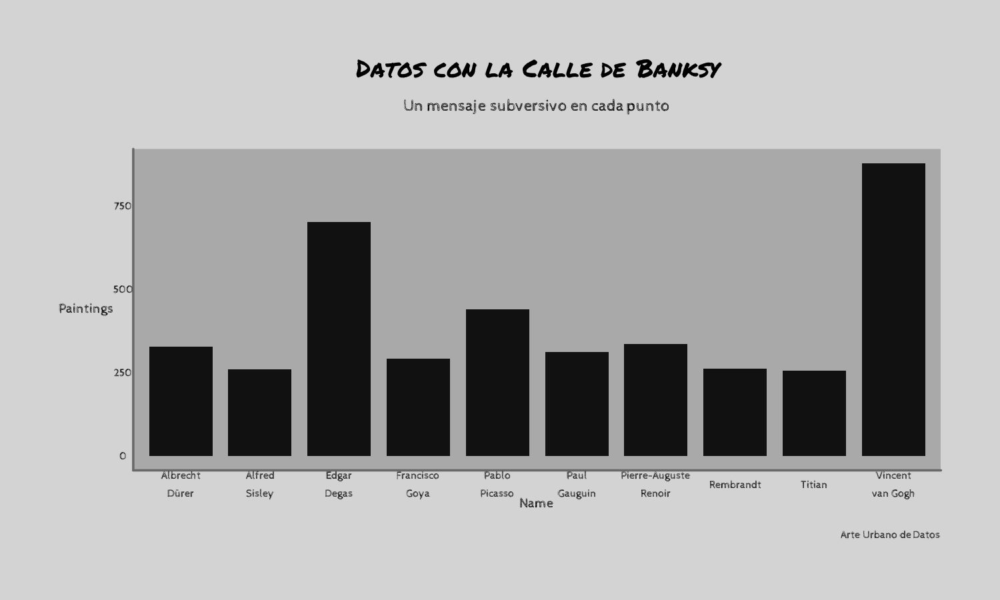
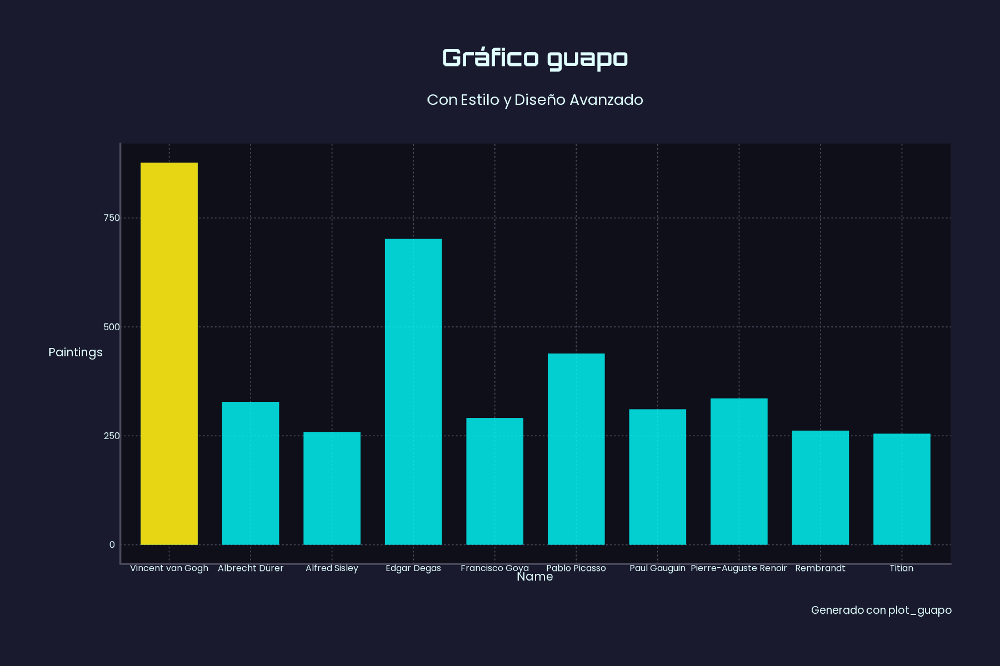

`{gguapo}` ofrece opciones rápidas para crear gráficos básicos (columnas, líneas, puntos y mapas) con la lógica de ggplot2 y con estilos únicos inspirados en artistas reconocidos. Además cuenta con funciones propias para hacer visualizaciones con mayor impacto visual.

¿Te imaginaste alguna vez a Van Gogh como analista de datos? 

**Disclaimers varios**

1. Este paquete surge con la intención estilizar gráficos de manera rápida y diferente a los típicos parámetros estéticos que vienen predefinidos. Se busca aprovechar la infinidad de atributos que ggplot2 permite modificar, sin dejar de lado la sobriedad y el estilo formal.

2. Es un paquete en desarrollo, seguramente habrá cambios y agregados a futuro.

3. Las funciones de estilo inspiradas en artistas y sus obras no buscan representar necesariamente el estilo real de los mismos. Es una búsqueda inspirada en paletas de colores, fuentes y otros recursos estéticos.

4. La selección de artistas fue arbitraria y pensada en contar con variedad de estilos, no representa el gusto artístico del autor del paquete (el cual dicho sea de paso no es experto en arte). 

5. La mayor parte del código y las decisiones estéticas fueron realizadas con IA. Cualquier error o queja, es culpa de los robots y del estado actual del arte. También un poco culpa del autor del paquete por no dedicarle el tiempo suficiente a revisarlo.

6. Las funciones se nutren de varios y maravillosos paquetes que forman parte del universo ggplot. Como los grandes artistas, un poco hay que ~~robarle a~~ inspirarse en otros.

## Instrucciones de instalación

Versión en desarrollo:

``` r
devtools::install_github("eliansoutu/gguapo", upgrade = F)
```

## Funciones principales

-   **`style_()`**: funciones propias de cada artista con atributos predefinidos y personalizables. Los artistas representados son: Da Vinci (`da_vinci`), Van Gogh (`van_gogh`), Michelangelo (`michelangelo`), Rembrandt (`rembrandt`), Monet (`monet`), Banksy (`banksy`), Dalí (`salvador_dali`), Miró (`miro`), Gentileschi (`artemisia_gentileschi`), Kandinsky (`kandinsky`) y Warhol (`warhol`). Cada artista, además, posee tres variantes de estilos basadas en tres de sus obras principales (ver documentación de cada función).

-   **`plot_guapo()`**: ofrece parámetros estéticos fáciles de ajustar para crear gráficos guapos.

-   **`load_all_fonts()`**: necesaria para cargar las fuentes que utilizan los distintos estilos. Se ejecuta una vez por sesión.

-   **`mapa_guapo()`**: alternativa al `plot_guapo` y con un enfoque de diseño orientado a mapas.

-   **`plot_porcentaje()` (en desarrollo)**: pensada para representar porcentajes con un estilo visual específico.


## Modo de uso

Estos son ejemplos básicos sobre cómo utilizar las funciones de la librería:

### style_()

``` r
library(gguapo)

data <- structure(list(name = c("Vincent van Gogh", "Edgar Degas", "Pablo Picasso", 
"Pierre-Auguste Renoir", "Albrecht Dürer", "Paul Gauguin", "Francisco Goya", 
"Rembrandt", "Alfred Sisley", "Titian"), genre = c("Post-Impressionism", 
"Impressionism", "Cubism", "Impressionism", "Northern Renaissance", 
"Symbolism,Post-Impressionism", "Romanticism", "Baroque", "Impressionism", 
"High Renaissance,Mannerism"), paintings = c(877L, 702L, 439L, 
336L, 328L, 311L, 291L, 262L, 259L, 255L)), class = "data.frame", row.names = c(NA, 
-10L))

load_all_fonts()

style_banksy(data, dplyr::mutate(name = stringr::str_wrap(name, 10)), "name", "paintings", plot_type = "column")

```


### plot_guapo

Función propia para crear gráficos estilizados y hacer retoques estéticos, por ejemplo, resaltar un valor de manera sencilla:

``` r
plot_guapo(data, "name", "paintings", plot_type = "column", title = "Gráfico guapo", dark_mode = T, highlight_values = c("Vincent van Gogh"))

```


*Datos de ejemplo en base a:* https://www.kaggle.com/datasets/ikarus777/best-artworks-of-all-time/data

Ver vignettes para más detalles sobre el uso de las funciones.

## Cómo contribuir con el proyecto

Para colaborar en este proyecto, se recomienda hacer un Fork, trabajar
sobre ese repositorio y, antes de hacer el pull request, correr el
`devtools::check()` para garantizar que no haya conflictos.

Sentíte libre de hacer tu aporte, sea agregar nuevas funciones con estilos o modificar parámetros de las actuales.
