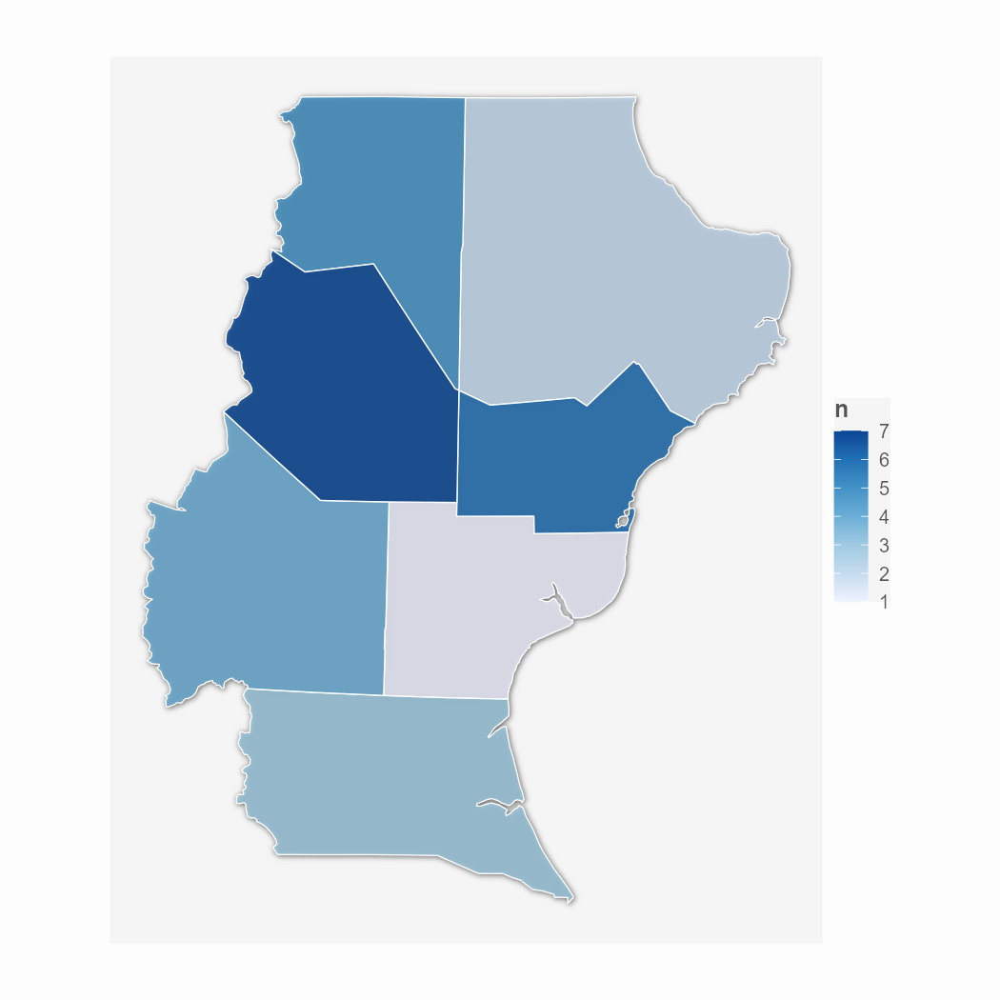

```{r, include = FALSE}
knitr::opts_chunk$set(fig.width = 10, fig.height = 7, fig.align = "center",
  collapse = TRUE,
   warning = FALSE,
  message = FALSE,
  comment = "#>"
)
```

```{r setup}
library(gguapo)
```


```{r}
data <- structure(list(name = c("Van Gogh", "Degas", "Picasso", 
"Renoir", "Dürer", "Gauguin", "Goya", 
"Rembrandt", "Sisley", "Titian"), genre = c("Post-Impressionism", 
"Impressionism", "Cubism", "Impressionism", "Northern Renaissance", 
"Symbolism,Post-Impressionism", "Romanticism", "Baroque", "Impressionism", 
"High Renaissance,Mannerism"), paintings = c(877L, 702L, 439L, 
336L, 328L, 311L, 291L, 262L, 259L, 255L)), class = "data.frame", row.names = c(NA, 
-10L))
```

## plot_guapo

`gguapo` provee una función genérica para aplicar un estilo limpio y elegante a tus gráficos, con distintos parámetros que se pueden ajustar. La salida predeterminada luce así:

```{r}
plot_guapo(data, name, paintings)
```

### fill_var/color_var + plot_type

```{r}
plot_guapo(data, name, paintings, fill_var = genre, plot_type = "column")
```

### palette_name + dark_mode

plot_guapo tiene algunas variantes de paletas para utilizar. Las opciones son: guapo, guapero, guapon y guapisimo.
Además, con el dark_mode se puede cambiar la estética general a algo oscuro/claro.

```{r}
plot_guapo(data, name, paintings, plot_type = "column", palette_name = "guapero")
```

```{r}
plot_guapo(data, name, paintings, plot_type = "column", 
           palette_name = "guapisimo", dark_mode = T)
```

### highlight_values

Una opción útil es resaltar algún dato, para lo cual podemos indicar el valor del eje x que nos interesa destacar.

```{r}
plot_guapo(data, name, paintings, plot_type = "column", dark_mode = T, 
           highlight_values = c("Picasso"))
```

### Otros

Hay múltiples parámetros para ajustar. Por ejemplo, sombras, brillo y difuminación.

```{r}
plot_guapo(data, name, paintings, plot_type = "column", dark_mode = T,
           apply_shadow = T, apply_glow = T, apply_blur_background = T)
```

## mapa_guapo

`plot_guapo` acepta objetos sf para hacer mapas, sin embargo, una alternativa estilística es usar `mapa_guapo` que tiene un enfoque distinto.

```{r}
# Datos de los polígonos en WKT
wkt_poligonos <- c(
  "POLYGON ((0 0, 1 0, 1 1, 0 1, 0 0))",
  "POLYGON ((2 2, 3 2, 3 3, 2 3, 2 2))"
)

# Crear objetos sf a partir de WKT
geometrias <- sf::st_as_sfc(wkt_poligonos, crs = 4326) # Asignamos el CRS aquí

# Crear un dataframe con atributos
df_atributos <- data.frame(
  nombre = c("Cuadrado A", "Cuadrado B"),
  valor = c(10, 25)
)

# Unir las geometrías con los atributos para formar el sf dataframe de ejemplo
sf_prueba_cuadrados <- sf::st_sf(df_atributos, geometry = geometrias)

mapa_guapo(data = sf_prueba_cuadrados, fill = valor)
```

Aplicado a un objeto geográfico real se vería:



